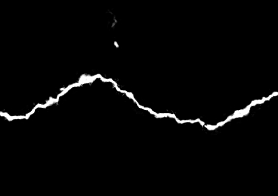
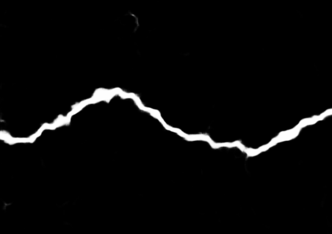
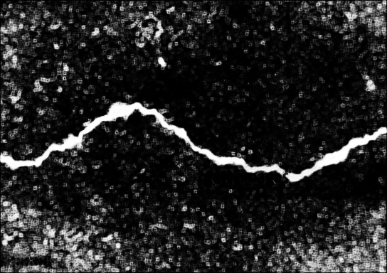
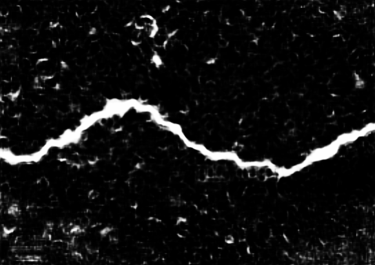
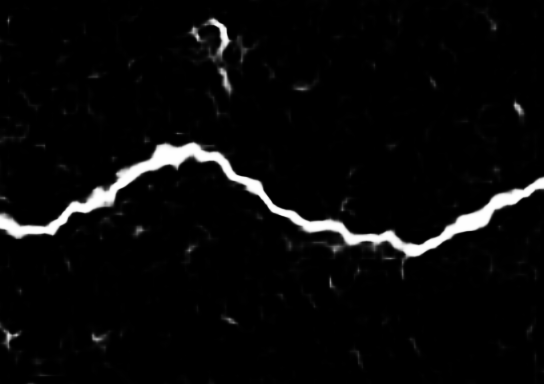
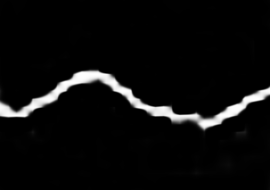
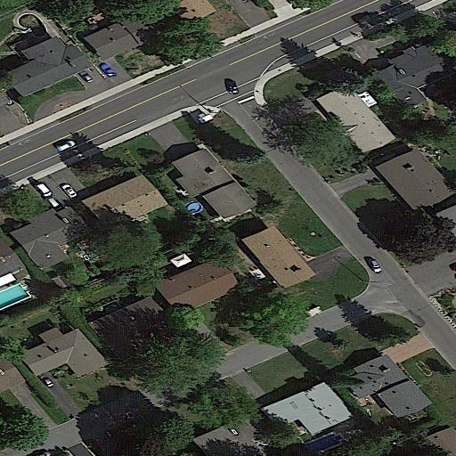
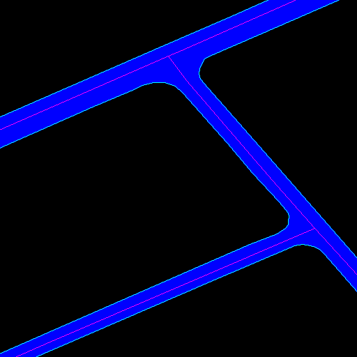
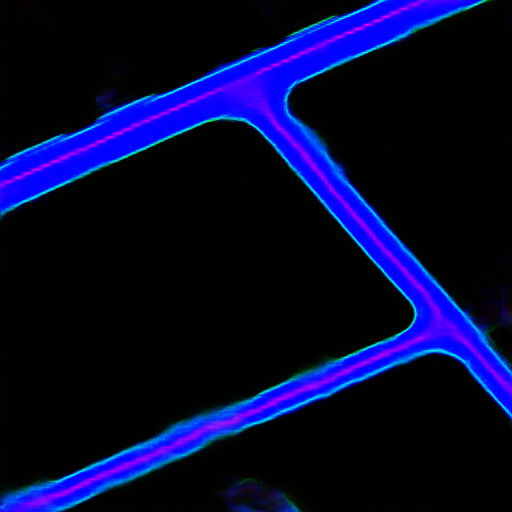

[]((https://github.com/yhlleo/DeepSegmentor/graphs/commit-activity))


# DeepSegmentor
A Pytorch implementation of DeepCrack and RoadNet projects.

### 1.Datasets

 - [Crack Detection Dataset](https://github.com/yhlleo/DeepCrack)
 - [Multi-task Road Detection Dataset](https://github.com/yhlleo/RoadNet)

Please download the corresponding dataset and prepare it by following the [guidance](./datasets/README.md). 

### 2.Installation

We provide an user-friendly configuring method via [Conda](https://docs.conda.io/en/latest/) system, and you can create a new Conda environment using the command:

```
conda env create -f environment.yml
```

### 3.Balancing Weights

We follow the [Median Frequency Balancing](https://arxiv.org/pdf/1411.4734.pdf) method, using the command:
```
python3 ./tools/calculate_weights.py --data_path <path_to_segmentation>
```

### 4.Training

Before the training, please download the dataset and copy it into the folder `datasets`. 

 - Crack Detection

```
sh ./scripts/train_deepcrack.sh <gpu_id>
```
 - Road Detection

 ```
sh ./scripts/train_roadnet.sh <gpu_id>
```

We provide our pretrained models here:

|Model|Google Drive|Baidu Yun|Others|
|:----|:----:|:----:|:----:|
|DeepCrack|:ok_hand:[[link]](https://drive.google.com/open?id=1MAwIlWw27feU8EEkP8pgbia7kcuxBwEG)|:ok_hand:[[link]](https://pan.baidu.com/s/1eFdX8rKV9cGiZJS3CQFCrQ)(psw: 3fai)|Fine-tuned|
|RoadNet|:ok_hand:[[link]](https://drive.google.com/open?id=1mTKp2ej9T3CUp3mV477w9EOx4EfcsGXE)|:ok_hand:[[link]](https://pan.baidu.com/s/1GEevUwp1xrEtASjixawrwg)(psw: c2gi)|Roughly trained|
|RoadNet++|[link]|[link]|-|

### 5.Testing

 - Crack Detection

```
sh ./scripts/test_deepcrack.sh <gpu_id>
```
|Image|Ground Truth|GF|fused|side1|side2|side3|side4|side5|
|:----:|:----:|:----:|:----:|:----:|:----:|:----:|:----:|:----|
||||||||||

[[See more examples >>>]](./figures/deepcrack.md)

 - Road Detection

```
sh ./scripts/test_roadnet.sh <gpu_id>
```
|Image|Ground Truth|Prediction|
|:----:|:----:|:----:|
||||

[[See more examples >>>]](./figures/roadnet.md)

### 6.Evaluation

 - Metrics (appeared in our papers):

 |Metric|Description|Usage|
 |:----:|:-----|:----:|
 |P|Precision, `TP/(TP+FP)`|segmentation|
 |R|Recall, `TP/(TP+FN)`|segmentation|
 |F|F-score, `2PR/(P+R)`|segmentation|
 |TPR|True Positive Rate, `TP/(TP+FN)`|segmentation|
 |FPR|False Positive Rate, `FP/(FP+TN)`|segmentation|
 |AUC|The Area Under the ROC Curve|segmentation|
 |G|Global accuracy, measures the percentage of the pixels correctly predicted|segmentation|
 |C|Class average accuracy, means the predictive accuracy over all classes|segmentation|
 |I/U|Mean intersection over union|segmentation|
 |ODS|the best F-measure on the dataset for a fixed scale|edge,centerline|
 |OIS|the aggregate F-measure on the dataset for the best scale in each image|edge,centerline|
 |AP|the average precision on the full recall range|edge,centerline|

 **Note**: If you want to apply the standard non-maximum suppression (NMS) for edge/centerline thinning. Please see more details in [Piotr's Structured Forest matlab toolbox](https://github.com/pdollar/edges) or some helper functions provided in the [hed/eval](https://github.com/s9xie/hed_release-deprecated/tree/master/examples/eval).

[[See more details (*Evaluation* + *Guided Filter* + *CRF*) >>>]](./eval/README.md)

Usage:

```
cd eval
python eval.py --metric_mode prf --model_name deepcrack --output deepcrack.prf
```

[[Display the accuracy curves >>>]](./plots)

### Acknowledgment

- This code is based on the [pytorch-CycleGAN-and-pix2pix](https://github.com/junyanz/pytorch-CycleGAN-and-pix2pix). Thanks to the contributors of this project. 

- If you are familar to [Google Colab](https://colab.research.google.com/), there is an implementation of [Colab version](https://colab.research.google.com/drive/13qSMnU1ERU7riHMMiv9MEEr7VTMhfZs9?usp=sharing) (provided by [DZDL/DeepSegmentor](https://github.com/DZDL/DeepSegmentor)). Besides, there is a WebApp version of this project: [crack-detector](https://github.com/DZDL/crack-detector). 

### References

If you take use of our datasets or code, please cite our papers:

```
@article{liu2019deepcrack,
  title={DeepCrack: A Deep Hierarchical Feature Learning Architecture for Crack Segmentation},
  author={Liu, Yahui and Yao, Jian and Lu, Xiaohu and Xie, Renping and Li, Li},
  journal={Neurocomputing},
  volume={338},
  pages={139--153},
  year={2019},
  doi={10.1016/j.neucom.2019.01.036}
}

@article{liu2019roadnet,
  title={RoadNet: Learning to Comprehensively Analyze Road Networks in Complex Urban Scenes from High-Resolution Remotely Sensed Images},
  author={Liu, Yahui and Yao, Jian and Lu, Xiaohu and Xia, Menghan and Wang, Xingbo and Liu, Yuan},
  journal={IEEE Transactions on Geoscience and Remote Sensing},
  volume={57},
  number={4},
  pages={2043--2056},
  year={2019},
  doi={10.1109/TGRS.2018.2870871}
}
```

If you have any questions, please contact me without hesitation (yahui.liu AT unitn.it).
