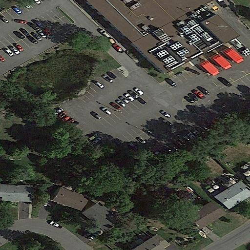
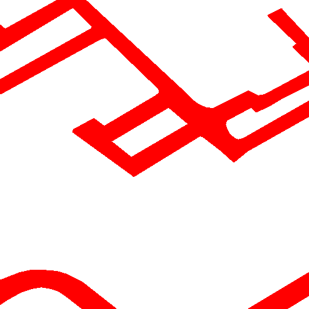
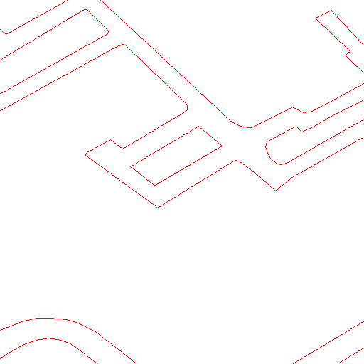
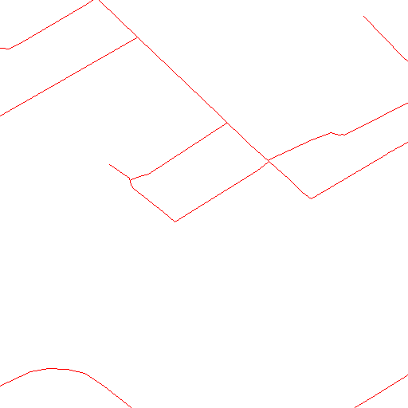

## Datasets

### DeepCrack 

dataset tree:

```
DeepCrack
  |__train_img
  |    |__a.jpg
  |    |__...
  |__train_lab
  |    |__a.png
  |    |__...
  |__test_img
  |    |__b.jpg
  |    |__...
  |__test_lab
       |__b.png
       |__...
```

Example:

|Image|Label|
|:----:|:----:|
|||

### RoadNet 

dataset tree:

```
RoadNet
  |__train_image
  |    |__a.png
  |    |__...
  |__train_segment
  |    |__a.png
  |    |__...
  |__train_edge
  |    |__a.png
  |    |__...
  |__train_centerline
  |    |__a.png
  |    |__...
  |__test_image
  |    |__b.png
  |    |__...
  |__test_segment
  |    |__b.png
  |    |__...
  |__test_edge
  |    |__b.png
  |    |__...
  |__test_centerline
       |__b.png
       |__...
```

We provide an automatic cropping tool in `tools` and you can use it by the command lines:

```
cd tools
sh ./crop_loop.sh
```

**Note**: please download the dataset and configurate the paths. The cropped images occupy about 20GB of HD space. 

Example:

|Image|Segment|Edge|Centerline|
|:----:|:----:|:----:|:----:|
|||||
